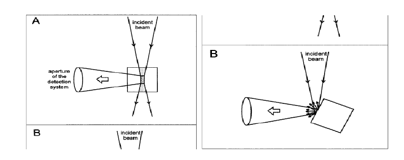

In order to avoid the transmitted radiation, the emitted fluorescence is usually collected with an right angle observation, i.e., the detection system collects the fluorescence emitted perpendicularly to the excitation beam in a fluorimeter. In such right angle observation, the detection system collects the fluorescence emitted only from the central part of the exciting beam (**Figure 1**) . The incident beam has to travel a certain path length through the cuvette before reaching the central part of the cuvette. Therefore, there is a possibility of a fraction of the incident beam being absorbed by the sample molecules while the beam travels through them. If the concentration of the solution is large (Absorbance, A, or optical density > ~0.1), a significant part of the incident light gets absorbed before reaching the central part of the cuvette. For instance, if the absorbance (A = log I0/I) at the excitation wavelength is 0.1, for a 1 x 1 cm cuvette, the light intensity at the center of the cuvette (I) will be 0.88 x I0, where I0 is the intensity of the light incident to the cuvette. Since the observed fluorescence intensity is proportional to the intensity of the exciting light, the actual fluorescence intensity or quantum yield will be about 10% less than that observed for an infinitely dilute solution. The decrease in the observed fluorescence due to the absorption of the incident light is known as the primary inner filter effect or excitation inner filter effect. This effect results in decrease in the intensity of the excitation light at the point of observation. The fluorescence photons emitted may get absorbed, if the energies of the emitted photons fall in the region overlapping the absorption spectrum. The attenuation in the observed fluorescence due to absorption of the emitted light is known as the secondary inner filter effect or the emission inner filter effect (self-absorption). This effect distorts the shape of the fluorescence spectrum in the overlapping region. The larger the absorption-emission spectral overlap (i.e., the smaller the Stokes shift), the larger the distortion. The inner filter effects depend on the concentrations or optical densities of the samples. The effect of concentration on fluorescence can be dramatic with fluorophores that have small Stokes shifts like rhodamine 6G. The color of rhodamine 6G solution changes from green to orange (i.e., emission spectra shift to longer wavelengths) with the increasing rhodamine 6G concentration. This is due to re-absorption of the shorter wavelength part of the emission. Attenuation of the blue edge of the emission is most pronounced for fluorophores that have significant overlap of the absorption and emission bands. When right-angle observation is used, the short-wavelength emission bands of anthracene are attenuated at high concentrations or large optical densities, because these shorter wavelengths are absorbed by anthracene.

Further, at high fluorophore concentrations the fluorophore molecules remain close to each other that can result in fluorescence quenching due to other interactions, such as concentration quenching, excimer formation, etc. All these effects are difficult to correct. Therefore, it is advisory to work with as much as possible dilute solutions. The fluorescence intensity is linearly proportional to the fluorophore concentration and hence to the optical density over only a limited range, only to an optical density of ~0.05. When an use of high concentration or optically dense medium is required, off-center illumination or front-face illumination geometries can be used. These geometries reduce the effective light path length due to the light absorption near the surface of the cuvette.

**Figure 1**. Geometries of the sample illumination versus emission beam recording: (A) conventional right-angle arrangement, and (B) front-face illumination. (Courtesey: B. Valeur, Molecular Fluorescence: Principles and Applications, 2002, Wiley-VCH, Weinheim.) 